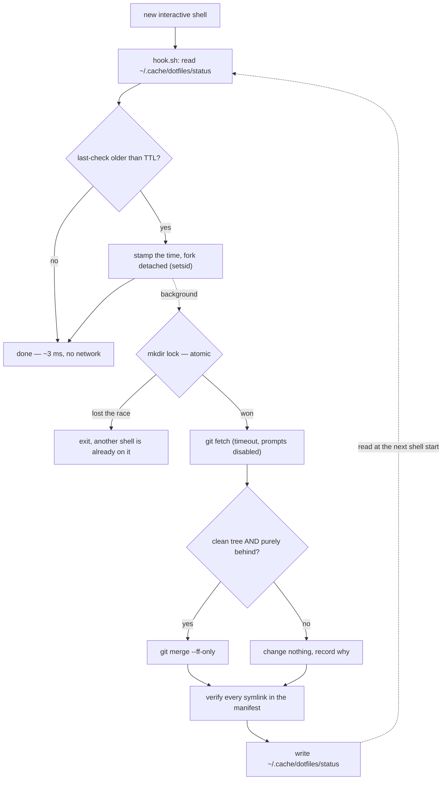

# dotfiles

Configuration shared between a desktop and a laptop: Claude Code rules and
skills, shell configs (bash / zsh / fish), git, tmux, lvim.

Config files in `$HOME` are **symlinks into this repo**. Editing
`~/.claude/rules/git.md` edits the repo — there is no copy step, and nothing
to remember to run. A background check picks up the other machine's commits
and fast-forwards them into place.

```sh
git clone https://github.com/kqesar/dotfiles.git ~/dotfiles
~/dotfiles/install.sh
```

## Commands

| Command | What it does |
|---|---|
| `dots status` | What is out of sync. No network, no writes. |
| `dots sync` | Pull the other machine's commits. Fast-forward only. |
| `dots push [-m MSG]` | Review, commit and publish local changes. |
| `dots link` | (Re)create the symlinks described by `manifest`. |
| `dots doctor` | Full diagnostic with guided repair. |

## How the shell integration works

Two design constraints drove everything: it must behave identically in bash,
zsh and fish, and it must add no perceptible latency to opening a terminal.

### One implementation for every shell

All the logic lives in `shell/hook.sh`, a POSIX `sh` script that is
**executed** in a subprocess, not *sourced*.

A sourced script has to be written in the host shell's dialect — which is why
oh-my-bash and oh-my-zsh exist as two separate projects, and why neither can
serve fish. This one has nothing to export into the calling shell: it reads
files, writes files, prints text. So `/bin/sh` is enough, and every shell runs
the same bytes.

Only the invocation differs, one line each:

| Shell | Hook point | Why there |
|---|---|---|
| bash | end of `~/.bashrc` | after the non-interactive early return, so it never runs for `scp`/`rsync` |
| zsh | end of `~/.zshrc` | `.zshrc` is interactive-only by definition |
| fish | `~/.config/fish/conf.d/dotfiles.fish` | fish sources `conf.d/*.fish` itself, so `config.fish` is never touched — installing and removing the hook is one file |

`dots` itself is symlinked into `~/.local/bin`, which is already on `PATH` on
any modern distro. No shell needs its `PATH` edited.

### Nothing waits for the network

A naive "check for updates on startup" runs `git fetch` synchronously: 200–800
ms added to every new tab, and lines printed over a prompt that was already
drawn. The check is split in two instead.



Consequences:

- The prompt never blocks on a socket, even with the network down.
- Background output can never race in over your prompt: the result is
  displayed at the *next* shell start.
- Opening twelve terminals at once triggers exactly one fetch. Two layers stop
  the stampede: the timestamp written before forking (cheap) and the lock
  (correct). `mkdir` is atomic on POSIX filesystems, which makes it a
  race-free lock primitive needing no extra tooling.

Set `DOTFILES_TTL` to change the four-hour default, `DOTFILES_DEBUG=1` to make
the background job log to `~/.cache/dotfiles/debug.log`.

### The background job never merges

Fast-forward or nothing. If the histories diverged, or the working tree is
dirty, it touches nothing and records why — you read it at the next shell
start and resolve it deliberately. A merge conflict resolved by an invisible
background job is a config silently broken on two machines at once.

For the same reason `dots push` is interactive and asks for a commit message.
Automatic commits on a public repo are how a secret leaves a machine without
anyone seeing it.

## What is shared, and what is not

`manifest` is the single source of truth: two columns, source in the repo and
target under `$HOME`. It is a **whitelist**. `dots push` refuses to stage any
path outside it, and `dots doctor` reports anything tracked that it does not
describe.

`.gitignore` blacklists the dangerous paths as well, but that is only a safety
net. The whitelist is the guarantee.

This matters because `~/.claude/` holds things that must never reach a public
repo: `.credentials.json` (the OAuth token), `projects/` (full transcripts of
every session, including anything pasted in), `history.jsonl`, and
`shell-snapshots/` (environment dumps).

Deliberately excluded:

| Path | Why |
|---|---|
| `~/.claude/settings.local.json` | Machine-local by design: absolute paths, per-session permission grants. Also where `autoMode` lives — see below. |
| `~/.claude/projects/*/memory/` | Content describes one machine (GPU, monitors) and would be wrong on the other. |
| `~/.claude/plugins/` | 7 MB, reinstallable. |
| `~/.config/fish/functions/{fisher,bass}.fish` | Plugin code, managed by fisher. The hand-written `nvm` helpers next to them *are* shared. |

### `settings.json` is split on purpose

Claude Code merges `settings.json` (user scope) with `settings.local.json`
(higher precedence). The shared file keeps only what is genuinely
cross-machine — `model`, `effortLevel`, `theme`, `hooks` — while `autoMode` is
kept local.

`autoMode.environment` is derived from the machine it was generated on. Shared,
it would differ on every machine and produce a permanent diff, on top of
describing the setup in a public repo.

### One config, two machines

Shared rc files guard every distro-specific `source` (`test -f … && source …`),
so a path that exists only on one machine degrades instead of breaking the
shell. Each one then loads `~/.config/dotfiles/local.{sh,fish}`, which is never
versioned. Anything specific to a machine goes there — no templating engine
needed.

## Known limitation: symlinks and atomic rewrites

Claude Code rewrites `~/.claude/settings.json` when you change model or theme
via `/config`. If it writes to a temporary file and `rename()`s it into place —
the usual safe-write pattern — **the rename replaces the symlink with a regular
file**. Sync silently stops for that file.

This is verified behaviour, not a theoretical concern, and it applies to any
tool that rewrites a config file atomically.

Mitigations:

- The background job re-checks every manifest link on each run (a `readlink`
  per entry, no network), so a broken link surfaces within one TTL rather than
  a month later.
- `dots doctor` repairs it, but shows the diff first and never overwrites
  silently: the file sitting at the target may hold the only up-to-date copy.
- Directories (`rules/`, `skills/`) are immune — nothing `rename()`s a
  directory. That is why the manifest links whole directories wherever it can,
  which also means a new file inside one is shared automatically.

## Layout

```
bin/dots            the CLI
lib/common.sh       shared helpers (manifest parsing, link state, git wrapper)
shell/hook.sh       what runs at shell startup
shell/init.posix    the snippet appended to ~/.bashrc and ~/.zshrc
shell/dotfiles.fish linked into ~/.config/fish/conf.d/
home/               everything that gets symlinked into $HOME
manifest            source → target table; the whitelist
legacy/             pre-2023 oh-my-bash config, kept for reference, unused
```

## Prerequisites

`git` and a POSIX `sh`. `install.sh` reports missing optional tools (tmux,
lvim, fzf, fisher) rather than installing them.

Pushing needs credentials that work without a prompt. An SSH key with a
passphrase and no running agent will not do: the background job disables all
prompts on purpose, and would otherwise hang forever holding the lock. This
clone uses `gh` as a repo-local credential helper over HTTPS:

```sh
git -C ~/dotfiles config credential.helper '!gh auth git-credential'
```

It is set per-repo rather than globally so the shared `.gitconfig` stays clean.
